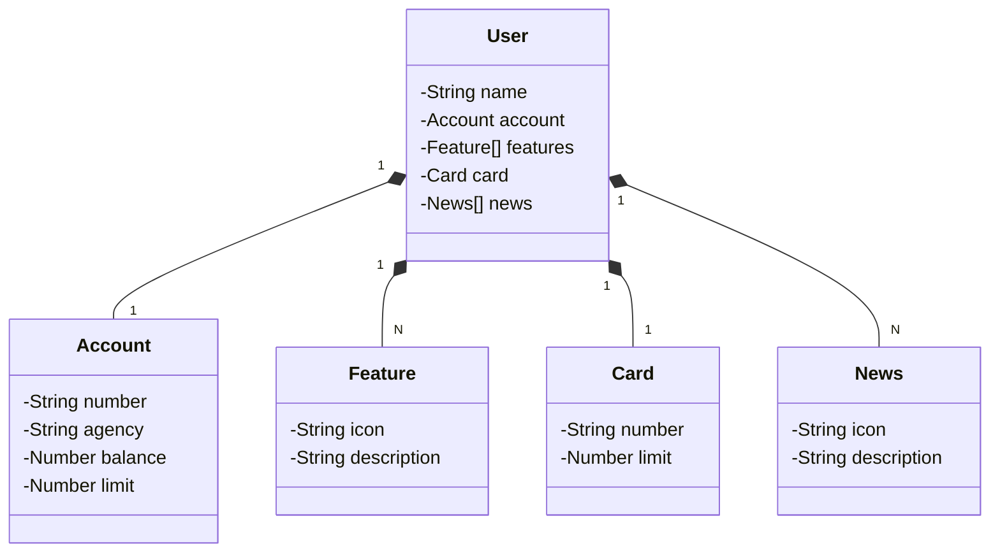

## API Santander - Documentação

Este repositório contém a documentação para uma API que simula o aplicativo Santander mostrado na imagem.


**Objetivo:**

O objetivo dessa API é permitir o acesso a informações importantes da conta do usuário, como:

- Nome do usuário
- Criação de Usuário

**Endpoints:**

A API possui os seguintes endpoints:

- **`/users`**: Retorna as informações básicas do usuário, incluindo nome e dados da conta.
- **`users/{id}**: Retorna a pesquisa feita pelo id do usuário.

**Exemplos de requisições:**

**GET `/users`**:

```json
{
  "id": 1,
  "name": "Fulano",
  "account": {
    "id": 1,
    "number": "000000000-0",
    "agency": "0000",
    "balance": 0,
    "limit": 10000
  },
  "card": {
    "id": 1,
    "number": "xxxx xxxx xxxx 0000",
    "limit": 10000
  },
  "features": [
    {
      "id": 1,
      "icon": "URL",
      "description": "Descrição da Feature"
    }
  ],
  "news": [
    {
      "id": 1,
      "icon": "URL",
      "description": "Descrição da Novidade"
    }
  ]
}
```

**Observações:**

- Esta API é apenas um exemplo e não possui conexão com o aplicativo real do Santander.
- A implementação da API dependerá da linguagem de programação escolhida e das ferramentas disponíveis.
- É importante garantir a segurança da API, incluindo a autenticação e autorização de usuários.

**Próximos passos:**

- Implementar a API utilizando a linguagem de programação escolhida.
- Implementar a lógica de acesso aos dados do usuário (simulando a interação com o aplicativo).
- Criar documentação detalhada da API, incluindo informações sobre endpoints, métodos, parâmetros e respostas.
- Implementar testes unitários e de integração para garantir a qualidade da API.

## Diagrama de Classes (Domínio da API)


