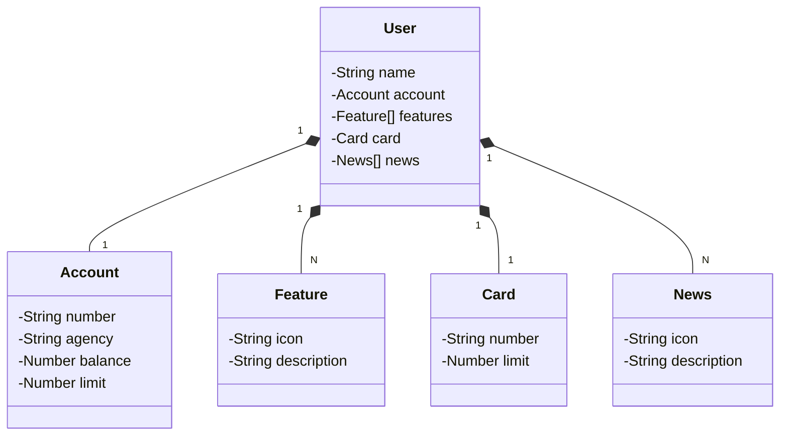

## API Santander - Documentação

Este repositório contém a documentação para uma API que simula o aplicativo Santander mostrado na imagem.

**Objetivo:**

O objetivo dessa API é permitir o acesso a informações importantes da conta do usuário, como:

- Nome do usuário
- Saldo disponível
- Limite do cartão
- Número da conta
- Número do cartão

**Endpoints:**

A API possui os seguintes endpoints:

- **`/user`**: Retorna as informações básicas do usuário, incluindo nome e dados da conta.
- **`/balance`**: Retorna o saldo disponível na conta do usuário.
- **`/limit`**: Retorna o limite do cartão do usuário.

**Exemplos de requisições:**

**GET `/user`**:

```
{
  "name": "Nome do Usuário",
  "account": "Ag 0000 Cc 00000000-0"
}
```

**GET `/balance`**:

```
{
  "balance": "1.324,64"
}
```

**GET `/limit`**:

```
{
  "limit": "2.324,64"
}
```

**Observações:**

- Esta API é apenas um exemplo e não possui conexão com o aplicativo real do Santander.
- A implementação da API dependerá da linguagem de programação escolhida e das ferramentas disponíveis.
- É importante garantir a segurança da API, incluindo a autenticação e autorização de usuários.

**Próximos passos:**

- Implementar a API utilizando a linguagem de programação escolhida.
- Implementar a lógica de acesso aos dados do usuário (simulando a interação com o aplicativo).
- Criar documentação detalhada da API, incluindo informações sobre endpoints, métodos, parâmetros e respostas.
- Implementar testes unitários e de integração para garantir a qualidade da API.

**Esperamos que esta documentação seja útil para o desenvolvimento da sua API!**


## Diagrama de Classes (Domínio da API)


